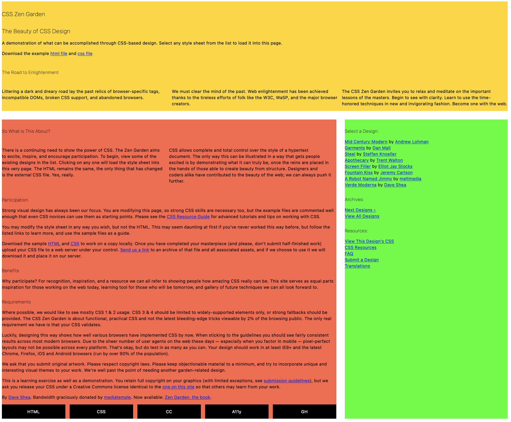
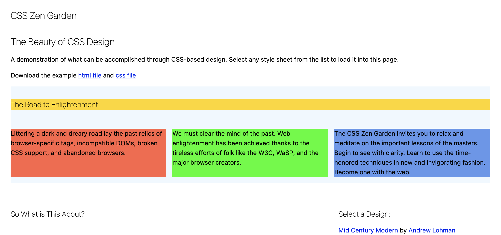
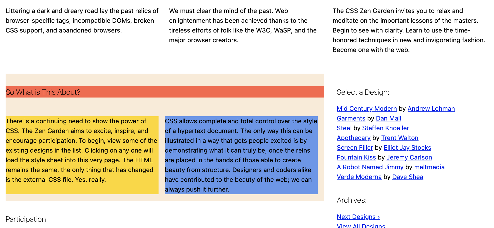

# FEW 2.2 Lesson 5 - CSS Grid

<!-- ## Review 

Imagine this is an interview question. 

Using the markup below create the button in the picture.

```HTML
<button class="next-button">Next</button>
```


Style the button using the markup above. You should only be adding CSS styles! 

The arrow image on the right side of the button should be added with the CSS background image property. Use the image below: 

<div style="background-color: black; margin: 1rem">
	
</div>

Really there is an image above but it has a white background! You should be able to click and save it to your desktop!

You'll need to do the following: 

- Give the button some padding
	- You'll need padding all sides
	- Use more padding on the right to leave room for the image
- Remove the border
- Set the font-size and color
- Set the background image with the following properties: 
	- background-image
	- background-size
	- background-position
	- background-repeat -->

## Learning Objectives 

- Use CSS Grid
- Define grid with columns and rows
- Map elements to grid cells
- Use media queries

## Video Lessons

https://www.youtube.com/playlist?list=PLoN_ejT35AEhF_M9vBuZgW0E4PiDb19oX

Watch videos: lesson 05 1-5

## What is a Grid? 

In design, a grid is used to create a system that arranges things on a page. Think of this as visually organizing your content. 

The first thing that comes to mind when you talk about a grid is graph paper. A grid in design looks a little different. A vertical grid is the space between each line and is based on the font size. Horizontally the grid is based on the column width. 

Here is a good article describing grid systems: 

https://www.oozlemedia.com/advantages-of-grid-systems-in-web-design/

## CSS Grid 

- Q: What does the CSS grid do? 
- A: CSS Grid arranges elements in rows and columns.

- Q: How is this different from Flex? 
- A: Flex is a one-dimensional arrangement. When using flex you choose an axis either horizontal or vertical. CSS grid on the other hand arranges elements on both the horizontal and vertical axis. 

- Q: Why use CSS grid over one of the CSS grid systems like Bootstrap?
- A: CSS Grid is simple enough it doesn't need an abstraction. It's more flexible and doesn't require all of the extra markup needed by a grid system like the one used in Bootstrap. 

- Q: Can you use CSS Grid and Flex together? 
- A: Yes! They both work together. You can use flex to arrange elements on a grid cell or use a grid inside an element arranged with flex. 

### Using CSS Grid

CSS Grid works similar to Flex, you set an element's display property to `grid` and all of the element's _children_ will be arranged in a grid. 

Grid is also different from Flex. A grid has two axes and allows you to define cells that make up the grid. It's more complex than Flex. 

Vocabulary

**Columns**

Columns are the horizontal divisions of the grid. Picture these as vertical bars that define the horizontal space. These are the most important measurement! 


**Gap/Gutter**

The grid gap or gutter is the space between the columns. 

**Rows**

These are the vertical divisions. Picture these as the horizontal bars that are stacked vertically. 


When you put them together you get a **grid**,


**Grid Cell**

A grid cell is a rectangular area that maps across any number of rows and columns. It has to be a rectangle! The edges must stop at the borders defined by the rows and columns. 


Generally speaking, _you can ignore the height of rows since the row height will be set by the height of the content_, though sometimes you will set this.

### Making a Grid with CSS

Imagine you have the following markup: 

```HTML
<div class="container">
	<div class="box a">One</div>
	<div class="box b">Two</div>
	<div class="box c">Three</div>
	<div class="box d">Four</div>
	<div class="box a">Five</div>
	<div class="box b">Six</div>
	<div class="box c">Seven</div>
	<div class="box d">Eight</div>
</div>
```

With this arrangement, you can use `div.container` to arrange all of the `div.box` in a grid. The following would arrange these elements into three columns with a `1em` gap. 

```CSS
.container {
	display: grid;
	grid-template-columns: 1fr 1fr 1fr;
	gap: 1em;
}
```

Let's take that apart. 

```CSS
.container {
	display: grid; /* .container arranges its children on a grid */
	...
}
```


```CSS
.container {
	...
	/* Creates three columns, which are each one fraction */
	grid-template-columns: 1fr 1fr 1fr;
	...
}
```


```CSS
.container {
	...
	gap: 1em; /* adds 1em space between columns and rows */
}
```

The `fr` is a unit that represents a fraction. A fractional unit takes up a fraction of the available space. In this each we have three fractions they should each be 1/3 or 33.333% of the space. 

If you had `1fr 1fr 1fr 1fr` each fraction would be 1/4 or 25%. 

Fraction can be any number. For example: `1fr 1fr 2fr` is a total of 4 fractions and would give us: 1/4, 1/4, and 1/2 or 25%, 25%, and 50%.

The code above is all you need for a simple grid where each cell is the same size. 

### Creating complex grids

CSS Grid provides more tools for creating more-complex grids. One of the best tools is `grid-areas`. This property allows you to define cells that span rows and columns and map elements to those cells. 

This time start with four divs. 

```HTML
<div class="container">
	<div class="box header">Header</div>
	<div class="box side">Sidebar</div>
	<div class="box main">main</div>
	<div class="box footer">Footer</div>
</div>
```

These elements represent the areas of the page and will be mapped to the grid. 

```CSS
.container {
	display: grid;
	grid-template-columns: 1fr 1fr 1fr 1fr;
	gap: 1em;
	grid-template-areas: 
		"h h h h" 
		"s m m m" 
		"s m m m"
		"f f f f"; /* Note the ; here! */
```

This time we have 4 columns each one fraction. 

The `grid-areas` property is where you will define your grid areas. The letters assign a name and the space used for a cell. 


The cells will map like this. Imagine `h` represents the header, `s` is the sidebar, `m` is the main content, and `f` is the footer. 


```
"h h h h" 
"s m m m" 
"s m m m"
"f f f f";
```

This arrangement creates four rows and four columns. Notice the syntax. You must use quotes on each line and end the last line with a semicolon. 

**Mapping Elements to Grid Areas**

Notice above that we have given each element a class name: `header`, `side`, `main`, and `footer`. Map each of these elements to one of the defined grid areas like this: 

```CSS
.header {
	grid-area: h;
}

.side {
	grid-area: s;
}

.main {
	grid-area: m;
}

.footer {
	grid-area: f;
}
```

Notice each element is assigned to a grid area by the letter assigned in the template. 

In other words `div.header` maps to the area defined by the `h`.

## Practice with CSS Grid

Above I showed two ways to use CSS Grid. These examples work with only three properties: `grid-template-columns`, `grid-template-areas`, `grid-gap`, and `grid-area`. CSS Grid has a few more properties. 

Explore some more features of CSS Grid here: 

- https://cssgridgarden.com

## Challenge

Using the CSS Zen Garden HTML try to recreat the following grid arrangement. 


**Step 1**

The goal of step 1 is to arrange the main elements of the page into header, main and sidebar. 



Declare `.page-wrapper` as `display: grid`. All of the children of page-wrapper can now be arrrnaged on a a grid. Identify the children. 

Declare three columns each `1fr` with `grid-template-columns: 1fr 1fr 1fr`. 

Now map the children to grid cells shown with the colors with `grid-template-areas`. Something like this:

```CSS
grid-template-areas:
	"h h h"
	"m m s"
	"m M s";
```

Last, map each child elements to the grid areas defined above. 

- `.main` to `grid-area: m`
- `.intro` to `grid-area: h`
- `.sidebar` to `grid-area: s`

**Step 2**

The goal is arrange the paragraphs in the `.preamble` section in three equal columns. 



Take a look at preamble. This div has four children. You want the header at the top and the three paragraphs in columns below. 

- Declare `.preamble` `display: grid`. 
- Define three fractional columns with `grid-template-columns`
- You can use `grid-template-areas` again. The same as above. It might be good to use different letters here to be clear. 
- Formulate selectors for each of the four children of `.preamble` and assign each to a grid area. 

**Step 2**

The goal for this step is to arrange the two paragraphs here into two equal columns and have the heading span both columns. 



To do this: 

- Declare `.explanation` display grid. 
- Define template columns with two fractions
- Define template areas with two columns and two rows. 
- Map the elements to their grid areas. 

## Resources 

- [Complete Guide to CSS Grid](https://css-tricks.com/snippets/css/complete-guide-grid/)
- [CSS Grid Docs](https://developer.mozilla.org/en-US/docs/Web/CSS/CSS_Grid_Layout)
- [Grid Systems](https://www.designsystems.com/space-grids-and-layouts/)
- [CSS Grid in 5 mins](https://www.freecodecamp.org/news/learn-css-grid-in-5-minutes-f582e87b1228/)
