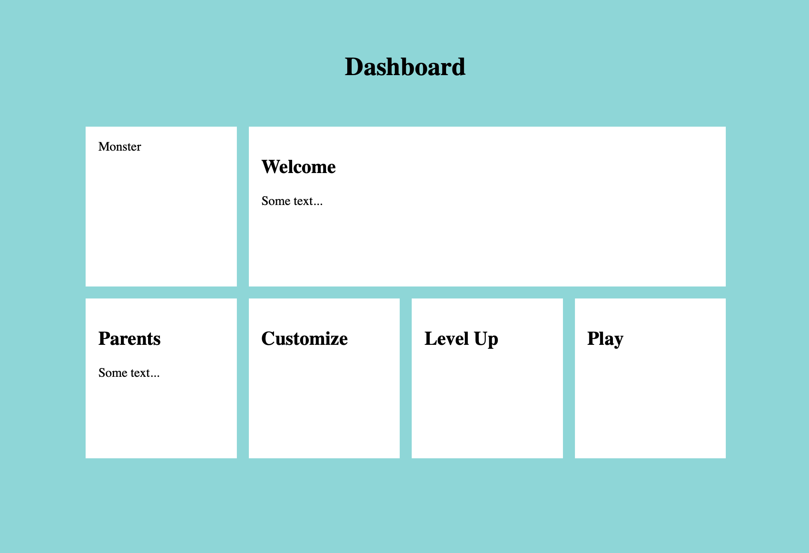

# FEW 2.2 - Advanced CSS - Frameworks

## Lesson Video

Follow this lesson lecture in video form: 

https://youtube.com/playlist?list=PLoN_ejT35AEhF_M9vBuZgW0E4PiDb19oX

Watch Lesson 06 1-3

## Review

Consider this exercise as a practice interview question. There are two parts: an on site question and a take home question. The take home question is at the bottom of this page [here](#after-class). 

Imagine you need to design a dashboard page for a new product. This page is divided into a grid. Below is an image showing what the final page might look like. 

Grid Challenge: 



Your goal is to recreate the image above with the markup below. Imagine this as a coding interview. 

Follow these steps: 

- Think about the problem and formulate at least one question for the interviewer. Your question should help clarify the problem and focus the expectation. 
- Outline your solution with comments. Think of this as Pseudo coding your solution! Review your pseudo code with the interviewer before coding! 
- Code your solution. 

```HTML
<!DOCTYPE html>
<html>
<head>
  <title>Dashboard</title>
  <style>
    
  </style>
</head>
<body>
  <div class="dashboard">
    <h1 class="title">Dashboard</h1>
    <div class="monster grid-cell">Monster</div>
    <div class="welcome grid-cell">
      <h2>Welcome</h2>
      <p>Some text... </p>
    </div>
    <div class="parents grid-cell">
      <h2>Parents</h2>
      <p>Some text... </p>
    </div>
    <div class="customize grid-cell">
      <h2>Customize</h2>
    </div>
    <div class="level-up grid-cell">
      <h2>Level Up</h2>
    </div>
    <div class="play grid-cell">
      <h2>Play</h2>
    </div>
  </div>
  
</body>
</html>
``` 

## Why you should know this?

A frontend developer should have an understanding of CSS frameworks. There is a lot to choose from they all have their pros and cons you should be able to get in and use any of these. 

## Learning Objectives 

1. Use CSS Frameworks
1. Evaluate CSS frameworks
1. Use CSS Custom properties

## What is a CSS Framework?

It could be a lot of things. Here a few popular CSS frameworks, you have used one or more of these:

- https://getbootstrap.com
- https://get.foundation
- https://bulma.io
- https://tailwindcss.com
- https://getuikit.com
- https://milligram.io
- https://purecss.io
- http://tachyons.io
- https://materializecss.com

Read up on these 9 CSS Frameworks here: https://athemes.com/collections/best-css-frameworks/

## Use the Framework

Each framework has its systems and paradigms. For the most part, they will work in this way: 

- You will link to a stylesheet you may also have the option to include a JS file. 
- Linking to the stylesheet will add a set of default styles that cover the common tags like:
 - Base font and typography
 - Headings
 - Links
 - Lists 
 - Tables 
 - form elements

The framework will offer more styles and custom elements that are created by using a combination of markup/HTML and class names. 

- Navbars
- buttons
- cards
- other features...

## Making your Framework

Study the frameworks above. Look at what they offer. You will make your framework! 

## After Class

Think of this asssignment as a junior level take home interview question. 

The goal is to style the Zen Garden markup using a CSS Framework. You can choose any of the frameworks above or use another. You must complete the work by the next class session and submit your solution to Gradescope. 

You should style as much of the page as you can to the best of your ability using the framework you choose. For this assignment you are allowed to modify the Zen Garden markup. 

Be sure to incorporate the following elements into your work: 

- Use Headings
- Use a card style 
- Use a button style
- Use Navbar style

## Additional Resources

- [9 CSS Frameworks](https://athemes.com/collections/best-css-frameworks/)
- [Beginners Guide to CSS Frameworks](https://blog.zipboard.co/a-beginners-guide-to-css-front-end-frameworks-8045a499456b)

