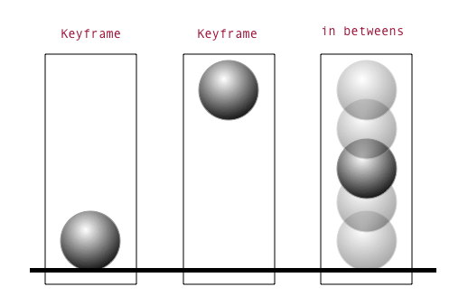
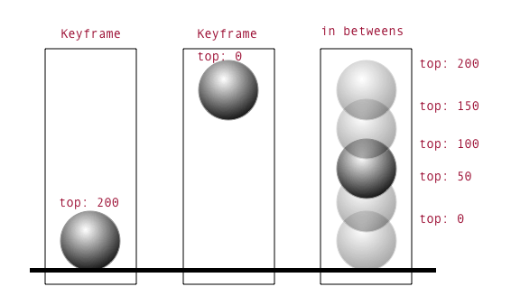

# FEW 2.2 - Animation part 2

Use @keyframes to create more complex animations.  

## Why you should know this?

All of the best applications use motion to their advantage! You want your applications and the applications you are building to stand out!

## Learning Objectives

- Describing key framing
- Describe in betweening
- Use `@keyframes` define key frames
- Use `animation` to make things move

## key frames

Animation is the creation of many still images that are played back quickly giving the appearance of smooth motion. 

In animation the concept of key frames is the idea of drawing the extremes of a motion. For example a ball bouncing the extremes would the ball at the highest point and the ball at the highest point. 



Most often you are animating numeric values and these numbers represent your key frames. 



You could define these key frames with `@keyframe` in CSS like this: 

```CSS
@keyframes bounce {
	0% { top: 0; }
	100% { top: 200px; }
}
```

The extremes of the animation are 0 and 200px. The values between these numbers are the in betweens. 

Inbetweens are the frames that need to be generated between the key frames! 

This applies to every property that needs to be animated. 

Notice that you have placed keyframes along the length of the animation using %. The time has not been set yet but the first key frame applies at 0% of the length of the animation and the last key frame applies at the end or 100% the length of the animation! 

To apply this key frame to an object use the animation properties: 

```CSS
.ball {
  animation-name: bounce; /* Set the key frames */
  animation-duration: 2s; /* Set the duration  */
  animation-iteration-count: infinite; /* Set the repeats */
  animation-direction: alternate; /* Set the direction */
  animation-timing-function: ease-out;
}
```

Animation has more than a few properties. Try and remember the concepts, look up the property names if you forget them. 

The process of using animation: 

- Define some key frames with `@keyframes`
- Assign your keyframes to an object with `animation-name`
- Set the duration of the animation with `animation-duration`
- set the number of times the animation should repeat with `animation-iteration-count`

From there you might use other properties to modify the animation you created. 

- Use `animation-direction` to play the animation forward, backward, alternate (back and forth)
- Use `animation-timing-function` to change the "quality" of the motion. This chnages the math function that generates the inbetween values. 
- Use `animation-delay` to create a pause before the animation starts. 
- Use `animation-fill-mode` to determine what happens before and after the animation. Often you'll use this to make an object stop at the end point of the animation instead of snapping back to it's starting value.

## @Keyframes and animation example

Use these properties to create longer more complex animations that can be looped and repeated. 

To create keyframe animations define some keyframes. A keyframe describes the values for CSS properties at a point in time. 

Assign keyframe animation a name, `scaleAndRotate` in the example below. 

Define the value for properties along the length of the animation. Here `transform: scale(0.5) rotate(0)` happens at the beginning `0%`, `background-color: blue` happens at the half way point `50%`, and `transform: scale(1.0) rotate(23deg)` happens at the end of the animation `100%`.
```CSS
@keyframes scaleAndRotate {
  0% { transform: scale(0.5) rotate(0); } /* state at 0% of the duration */
  50% { background-color: blue; } /* state at 50% of the duration */
  100% { transform: scale(1.0) rotate(23deg); } /* state at 100% of the duration */
}
```

The code above defines the animation. Below the animation is applied to an element. 

The `animation` property applies an animation to an element. The line: `animation: scaleAndRotate 5s infinite` sets the animation to `scaleAndRotate` (matches the name above), sets the length of the animation 5 secs (`5s`), and repeat infinitely (`infinite`).

```CSS
div {
  width: 100px;
  height: 100px;
  background: red;
  position :relative;
  
  animation-name: scaleAndRotate;
  animation-duration: 5s;
  animation-iteration-count: infinite;
}
```

You could also write this as: 

```CSS
div {
  width: 100px;
  height: 100px;
  background: red;
  position :relative;
  /* name duration iteration-count */
  animation: scaleAndRotate 5s infinite;
}
```

Here is a list of animation properties: 

- `animation-delay` Time to wati before starting the animation
- `animation-duration` Length of animation in seconds oe milliseconds
- `animation-fill-mode` The state of the element when the animation ends
- `animation-iteration-count` Number of times to repeat the animation
- `animation-name` Name of the keyframes
- `animation-play-state` Is the animation playing or not? 
- `animation-timing-function` Easing function to apply to this animation


## Challenges

The challenge for today is open ended. You will design your own loading animation. This can be anything you like. Take a look at the examples. 

You'll submit this to Gradescope! 

## Examples

Try these examples. 

### Example 0 

Basic animation that repeats for ever. 

```HTML
<div></div>

<style>
  html, body {
    height: 100%;
  }

  body {
    display: flex;
    justify-content: center;
    align-items: center;
  }

  div {
    width: 120px;
    height: 120px;
    background-color: #000;
  }

  @keyframes spin {
    0% { transform: rotate(0); }
    100% { transform: rotate(1turn); }
  }

  div {
    animation-name: spin;
    animation-duration: 5s;
    animation-iteration-count: infinite;
  }
</style>
```

### Example 1 

One of the most confusing properties is `animation-fill-mode`. This property determines how the object appears at the end of an animation. See the comments below. 

```HTML
<div></div>

<style>
  html, body {
    height: 100%;
  }

  body {
    display: flex;
    justify-content: center;
    align-items: center;
  }

  div {
    width: 120px;
    height: 120px;
    background-color: #000;
    border-radius: 60px 60px 60px 0;
  }

  @keyframes spin {
    0% { 
      transform: rotate(0); 
      background-color: #000;
    }
    100% { 
      transform: rotate(180deg); 
      background-color: #f0f;
    }
  }

  div {
    animation-name: spin;
    animation-duration: 5s;
    animation-iteration-count: 1;

    /* The most confusing property!
    Without this property the element "jumps"
    back to it's starting values at the end of 
    the animation. 
    Uncommenting the line below forces the 
    element to stay at the ending values of the 
    animation. */

    /* animation-fill-mode: forwards; */
  }
</style>
```

### Example 2

This example shows how keyframes can be shared across multiple objects. Thos objects can set their own options like duration. 

```HTML
<div></div>
<div></div>
<div></div>

<style>
  html, body {
    height: 100%;
  }

  body {
    position: relative;
  }

  div {
    position: absolute;
    /* Pay attention to calc here! */
    left: calc(50% - 60px);
    top: calc(50% - 60px);
    width: 120px;
    height: 120px;
  }

  @keyframes spin {
    0% { 
      transform: rotate(0); 	
    }
    100% { 
      transform: rotate(360deg); 
    }
  }

  /* 
    Here each element uses the same animation but they 
    each apply a different duration!
    Key frames can be shared!
  */

  div {
    animation-name: spin;
    animation-iteration-count: infinite;
    animation-timing-function: linear;
  }

  div:nth-child(1) {
    background-color: rgba(255, 64, 30, 0.511);
    animation-duration: 1s;
  }

  div:nth-child(2) {
    background-color: rgba(253, 220, 31, 0.66);
    animation-duration: 2s;
  }

  div:nth-child(3) {
    background-color: rgba(50, 118, 244, 0.712);
    animation-duration: 3s;
  }
</style>
```

### Example 3

Like the last example but here we have 6 objects all using the same keyframes. 

This example also shows how nested elements inherit the transformation of their parent element. Notice the inner boxes all rotate on their own but also orbit their parent, since the parent is rotating. 

```HTML
<div class="box">
  <div class="inner-box"></div>
</div>
<div class="box">
  <div class="inner-box"></div>
</div>
<div class="box">
  <div class="inner-box"></div>
</div>

<style>
  html, body {
    height: 100%;
  }

  body {
    position: relative;
  }

  .box {
    position: absolute;
    /* Pay attention to calc here! */
    left: calc(50% - 60px);
    top: calc(50% - 60px);
    width: 120px;
    height: 120px;
  }

  .inner-box {
    position: absolute;
    width: 60px;
    height: 60px;
    left: -90px;
    top: 30px;
    background-color: #000;
  }

  @keyframes spin {
    0% { 
      transform: rotate(0); 	
    }
    100% { 
      transform: rotate(360deg); 
    }
  }

  /* 
    Here each element uses the same animation but they 
    each apply a different duration!
    Key frames can be shared!
  */

  .box, .inner-box {
    animation-name: spin;
    animation-iteration-count: infinite;
    animation-timing-function: linear;
  }

  .box:nth-child(1) {
    background-color: rgba(255, 64, 30, 0.511);
    animation-duration: 4s;
  }

  .box:nth-child(2) {
    background-color: rgba(253, 220, 31, 0.66);
    animation-duration: 5s;
  }

  .box:nth-child(3) {
    background-color: rgba(50, 118, 244, 0.712);
    animation-duration: 7s;
  }

  .box:nth-child(1) > .inner-box {
    background-color: rgba(22, 223, 32, 0.511);
    animation-duration: 1s;
  }

  .box:nth-child(2) > .inner-box {
    background-color: rgba(31, 253, 231, 0.66);
    animation-duration: 2s;
  }

  .box:nth-child(3) > .inner-box {
    background-color: rgba(244, 50, 231, 0.712);
    animation-duration: 2s;
  }
</style>
```

### Example 4

This example shows how more complex animations can be created using many key frames. The animation implemented below defines key frames across 0% to 100% of the animation duration. 

Notcie that values that are "held" across keyframes need to be defined with the same values across keyframe steps. 

```HTML
<div class="box"></div>

<style>
  html, body {
    height: 100%;
  }

  body {
    position: relative;
  }

  .box {
    position: absolute;
    /* Pay attention to calc here! */
    left: calc(50% - 60px);
    top: calc(50% - 60px);
    width: 120px;
    height: 120px;
    background-color: #000;
    animation-name: spin;
    animation-duration: 5s;
    animation-iteration-count: infinite;
  }

  /* 
    
  A longer sequence of steps can be created.
    You'll need pay close attention to the 
    properties that you set!
    If a property has the same value across
    two key frame steps it will not change!
  
  Note! transform can only be set once!
    To carry the transform over you need
    to set all of the properties: scale, 
    rotate, translate etc. 
  */
  @keyframes spin{
    0% { 
      transform: rotate(0) scale(0); 
      border-radius: 0 0 0 0;	
      background-color: tomato;
    }
    10% { 
      transform: rotate(0) scale(1); 
      border-radius: 0 0 0 0;
      background-color: tomato;
    }
    20% { 
      transform: rotate(00deg) scale(1); 
      border-radius: 0 0 0 0;
      background-color: tomato;
    }

    30% {
      transform: rotate(90deg) scale(1); 
      border-radius: 0 60px 0 0;
      background-color: tomato;
    }

    40% {
      transform: rotate(180deg) scale(1); 
      border-radius: 0 60px 0 0;
      background-color: cornflowerblue;
    }

    50% {
      transform: rotate(180deg) scale(1); 
      border-radius: 0 60px 0 60px;
      background-color: cornflowerblue;
    }

    60% {
      transform: rotate(270deg) scale(1); 
      border-radius: 0 60px 0 60px;
      background-color: limegreen;
    }

    70% {
      transform: rotate(270deg) scale(1); 
      border-radius: 0 60px 0 60px;
      background-color: limegreen;
    }

    80% {
      transform: rotate(360deg) scale(1); 
      border-radius: 60px 60px 0 60px;
      background-color: fuchsia;
    }

    90% {
      transform: rotate(360deg) scale(1); 
      border-radius: 60px 60px 60px 60px;
      background-color: fuchsia;
    }

    100% {
      transform: rotate(360deg) scale(0); 
      border-radius: 60px 60px 60px 60px;
      background-color: fuchsia;
    }

  }
</style>
```

### Example 5

This example reprises the previous example but uses CSS custom properties to define values that throughout the code here. This allows us to easily resize, change the colors and duration of the animation. 

```HTML
<div class="box"></div>

<style>
  /* This example is the same as the previous example 
  but this time using custom properties to define the 
  values used. */

  :root {
    --color-a: tomato;
    --color-b: cornflowerblue;
    --color-c: limegreen;
    --color-d: gold;
    --color-e: fuchsia;
    --color-f: cyan;
    
    --size: 120px;
    --size-2: calc(var(--size) / 2);
    --time: 5s;
  }

  html, body {
    height: 100%;
  }

  body {
    position: relative;
  }

  .box {
    position: absolute;
    /* Pay attention to calc here! */
    left: calc(50% - var(--size-2));
    top: calc(50% - var(--size-2));
    width: var(--size);
    height: var(--size);
    background-color: #000;
    animation-name: spin;
    animation-duration: var(--time);
    animation-iteration-count: infinite;
  }

  @keyframes spin{
    0% { 
      transform: rotate(0) scale(0); 
      border-radius: 0 0 0 0;	
      background-color: var(--color-a);
    }
    10% { 
      transform: rotate(0) scale(1); 
      border-radius: 0 0 0 0;
      background-color: var(--color-a);
    }
    20% { 
      transform: rotate(00deg) scale(1); 
      border-radius: 0 0 0 0;
      background-color: var(--color-a);
    }

    30% {
      transform: rotate(90deg) scale(1); 
      border-radius: 0 var(--size-2) 0 0;
      background-color: var(--color-a);
    }

    40% {
      transform: rotate(180deg) scale(1); 
      border-radius: 0 var(--size-2) 0 0;
      background-color: var(--color-b);
    }

    50% {
      transform: rotate(180deg) scale(1); 
      border-radius: 0 var(--size-2) 0 var(--size-2);
      background-color: var(--color-b);
    }

    60% {
      transform: rotate(270deg) scale(1); 
      border-radius: 0 var(--size-2) 0 var(--size-2);
      background-color: var(--color-c);
    }

    70% {
      transform: rotate(270deg) scale(1); 
      border-radius: 0 var(--size-2) 0 var(--size-2);
      background-color: var(--color-c);
    }

    80% {
      transform: rotate(360deg) scale(1); 
      border-radius: var(--size-2) var(--size-2) 0 var(--size-2);
      background-color: var(--color-d);
    }

    90% {
      transform: rotate(360deg) scale(1); 
      border-radius: var(--size-2) var(--size-2) var(--size-2) var(--size-2);
      background-color: var(--color-d);
    }

    100% {
      transform: rotate(360deg) scale(0); 
      border-radius: var(--size-2) var(--size-2) var(--size-2) var(--size-2);
      background-color: var(--color-d);
    }

  }
</style>
```

## After Class 

Continue working on your redesign project. 

Submit your loading animation to gradescope. 

## Additional Resources

1. https://www.smashingmagazine.com/2011/07/learning-to-use-the-before-and-after-pseudo-elements-in-css/
1. https://codersblock.com/blog/diving-into-the-before-and-after-pseudo-elements/
1. https://dev.to/ruppysuppy/css-decoded-before-and-after-1o56

