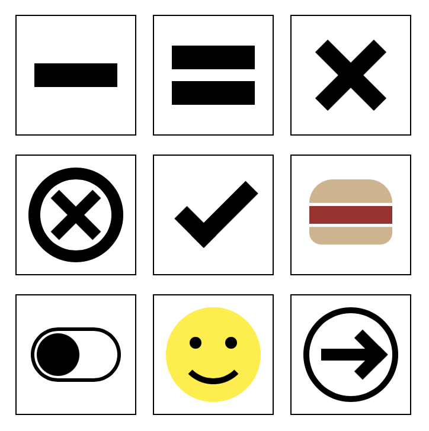

# Animation and position

## Objectives 

- Position objects anywhere with absolute position
- Define a context origina with position relative 
- Use relative position to offset 
- Transform objects with translate, rotate, and skew
- Set the stacking order of elements with z-index

## Relative position

An element with `position: relative` is positioned relative to its normal position. Relative position is applied after CSS does it's normal layout. 

## Absolute position

An element with `position: absolute` is positioned relative to the nearest positioned ancestor (instead of positioned relative to the viewport, like fixed).

However; if an absolute positioned element has no positioned ancestors, it uses the document body, and moves along with page scrolling.

Note: Absolute positioned elements are removed from the normal flow, and can overlap elements.

## Transform

The transform CSS property lets you rotate, scale, skew, or translate an element. It modifies the coordinate space of the CSS visual formatting model.

## top, right, bottom, and left

Use these properties offset an element from one of it's edges. For example setting `left: 100px` moves an element 100px to the right. Imagine the 100px pushing against the left edge. 

These properties only work when an element has position: `relative`, `absolute`, `fixed`, or `sticky`. 

## z-index

The z-index CSS property sets the z-order of a positioned element and its descendants or flex items. Overlapping elements with a larger z-index cover those with a smaller one.

This controls the stacking order of elements that share the same parent. 

These properties only work when an element has position: `relative`, `absolute`, `fixed`, or `sticky`. 

## What can you do with position? 

You can "draw" things that would be difficult or impossible with regular CSS layout tools. You can also modify the regular layout in ways that would not be possible without position. 

In short you can place elements anywhere on the screen without relying on regular CSS layout rules. 

## Absolute position and positioning context

When an element is assigned absolute position it looks for a positioning context. This positioning context where left right, top, and bottom are. 

By default the positioning context is body element. This means the left edge is the left side of the window, and the top edge is the top of the window. 

An absolutely positioned element looks up the DOM chain. The first ancestor element it finds that has relative position defines it's positioning context. That elements edges define where 0 is for each of the left, top, right, and bottom properties. 

## Stacking order

When elements are siblings they stack at their index. The first element is in the back and higher elements in front. 

When an element uses position other than `static` you can set the stacking order with `z-index`. Set `z-index` to any value higher numbers are in front of lower numbers. 

## A few notes on borders

The border property allows you to set the border of any element. The border can be set for any or all of the four sides. List the values in order: top, right, bottom, left. 

```CSS
div {
	border-style: solid none solid double;
	border-width: 10px 0 1rem 2mm;
}
```

You won't see a border unless you set the `border-style`! 

By default a border has the same color as the `color` of the element. 

If you set one side of a border to a color transparent you'll get a beveled or 45 degree edge. This is sometimes useful! 

## Read more about CSS position

https://developer.mozilla.org/en-US/docs/Learn/CSS/CSS_layout/Positioning

## Math in CSS

In regular "programming" languages you have operators available to handle all of the basic math and functions to handle higher level mathematical operations. CSS doesn't support this. 

That doesn't mean you can't do math in CSS. The `calc()` function will perform all of the standard math operations. Use it like this: 

```CSS
h1 {
	font-size: calc(18px * 3);
}

.page-wrapper {
	width: calc(100% - 4rems + 2px);
}

.box {
	border-radius: calc(40px / 2);
}
```

In the example above you'll see thast you can perform all of the basic math operation in the `calc()` function. 

The real magic, looking closely, is that calc allows us to mix units. 

Read more about calc: https://developer.mozilla.org/en-US/docs/Web/CSS/calc

## Challenges

You're goal is to create the drawings shown below using CSS. Use Position relative and position absolute to solve the problems! 



Below is the HTML that I started with. Feel free to work with this or change it to suit your needs. 

```HTML
<!DOCTYPE html>
<html lang="en">
<head>
	<meta charset="UTF-8">
	<meta http-equiv="X-UA-Compatible" content="IE=edge">
	<meta name="viewport" content="width=device-width, initial-scale=1.0">
	<title>Challenge</title>
</head>
<body>

	<style>
		/* These styles just apply to the page to arrange the boxes in the center */
		body, html { height: 100%; }
		body {
			display: flex;
			justify-content: center;
			align-items: center;
		}
		.page-wrapper {
			display: grid;
			grid-template-columns: repeat(3, 100px);
			gap: 1rem;
		}
	</style>

	<div class="page-wrapper">
		
	<!-- ------------------------------------------------------- -->
	<!-- Challenge 1 draw a dash put the inner div in the center -->
	<div class="challenge-1">
		<div></div>
	</div>

	<style>
		.challenge-1 {
			
		}

		.challenge-1 > div {
			
		}

	</style>
<!-- ------------------------------------------------------- -->

<!-- Challenge 2 draw an = with two divs -->

<div class="challenge-2">
	<div></div>
	<div></div>
</div>

<style>
	.challenge-2 {
		
	}

	.challenge-2 > div {
		
	}

	.challenge-2 > div:last-child {
		
	}
</style>
<!-- ------------------------------------------------------- -->

<!-- Challenge 3 draw an X with two divs -->

<div class="challenge-3">
	<div></div>
	<div></div>
</div>

<style>
	.challenge-3 {
		
	}

	.challenge-3 > div {
		
	}

	.challenge-3 > div:first-child {
		
	}

	.challenge-3 > div:last-child {
		
	}
</style>
<!-- ------------------------------------------------------- -->

 <!-- Challenge 4 draw a circle with an X  -->

<div class="challenge-4">
	<div></div>
	<div></div>
	<div></div>
</div>

<style>
	.challenge-4 {
		
	}

	.challenge-4 > div {
		
	}

	.challenge-4 > div:nth-child(1) {
		
	}

	.challenge-4 > div:nth-child(2) {
		
	}

	.challenge-4 > div:nth-child(3) {
		
	}
</style>
<!-- ------------------------------------------------------- -->

<!-- Challenge 5 draw a check mark -->

<div class="challenge-5">
	<div></div>
</div>

<style>
	.challenge-5 {
		
	}

	.challenge-5 > div {
		
	}
</style>
<!-- ------------------------------------------------------- -->

<!-- Challenge 6 draw a hamburger -->
<!-- Stretch Challenge: Add lettuce, tomato, and cheese -->

<div class="challenge-6">
	<div></div>
	<div></div>
	<div></div>
</div>

<style>
	.challenge-6 {
		
	}

	.challenge-6 > div {
		
	}

	.challenge-6 > div:nth-child(1) {
		
	}

	.challenge-6 > div:nth-child(2) {
		
	}

	.challenge-6 > div:nth-child(3) {
		
	}
</style>
<!-- ------------------------------------------------------- -->

<!-- Challenge 7 draw the apple switch -->

<div class="challenge-7">
	<div>
		<div></div>
	</div>
</div>

<style>
	.challenge-7 {
		
	}

	.challenge-7 > div {
		
	}

	.challenge-7 > div > div {
		
	}

	
</style>
<!-- ------------------------------------------------------- -->

<!-- Challenge 8 Draw a smilley face -->

<div class="challenge-8">
	<div>
		<div></div>
		<div></div>
		<div></div>
	</div>
</div>

<style>
	.challenge-8 {
		
	}

	.challenge-8 > div {
		
	}

	.challenge-8 > div > div:nth-child(1) {
		
	}

	.challenge-8 > div > div:nth-child(2) {
		
	}

	.challenge-8 > div > div:nth-child(3) {
		
	}
	
</style>
<!-- ------------------------------------------------------- -->

<!-- Challenge 9 -->

<div class="challenge-9">
	<div>
		<div></div>
		<div></div>
	</div>
</div>

<style>
	.challenge-9 {
		
	}

	.challenge-9 > div {
		
	}

	.challenge-9 > div > div:nth-child(1) {
		
	}

	.challenge-9 > div > div:nth-child(2) {
		
	}

</style>
<!-- ------------------------------------------------------- -->


</div>

</body>
</html>
```

